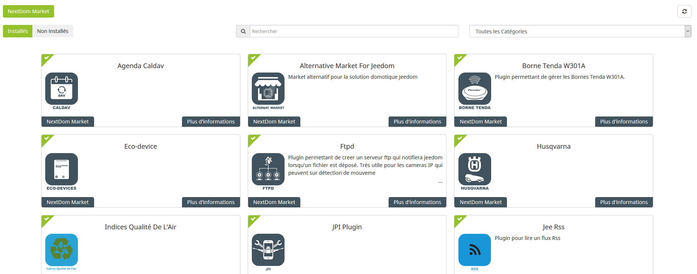
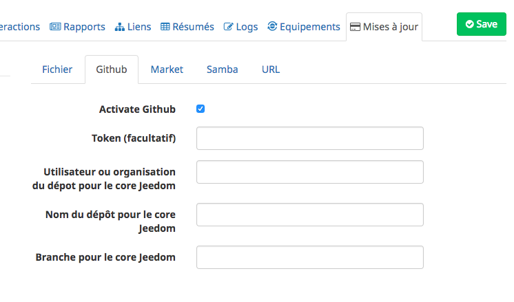
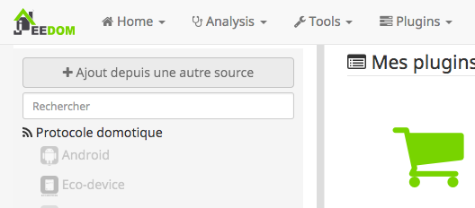

# Plugin AlternativeMarketForJeedom pour Jeedom

Alternative Market For Jeedom vous permettra d'installer des plugins directement depuis les sources des développeurs.

Ceci vous donnera la possibilité de :

 - Accéder à des versions en développement de plugins,
 - Installer des plugins de développeurs gardant leur indépendance,
 - Installer des plugins ne respectant pas la charte du Market Jeedom.
 

 
### Installation

1. Activer l'option de Jeedom permettant d'installer directement depuis GitHub. Pour cela, cocher la case ci-dessous se trouvant dans l'onglet __Mise à jour__ de la configuration : 

2. Dans la __Gestion des plugins__, faire apparaitre le menu de gauche et cliquer sur __Ajouter depuis une autre source__

3. Remplir les informations suivantes : 
* Type de source : __GitHub__,
* ID logique du plugin : __AlternativeMarketForJeedom__,
* Utiliser ou organisation du dépôt : __NextDom__,
* Nom du dépôt : __plugin-AlternativeMarketForJeedom__,
* Branche : __master__ (par défaut).

### Documentation

Vous trouverez la documentation [ici](https://github.com/cyrilphoenix71/jeedom_Opening/blob/stable/doc/fr_FR/index.asciidoc)
