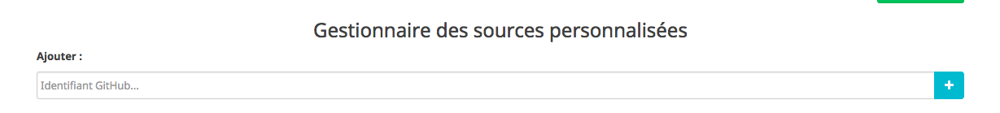

# Configuration

## Ajouter les dépôts d'un utilisateur GitHub

1. Dans la page de configuration du plugin, cliquer sur __Gérer__ pour accéder à l'interface de gestion des sources.

2. Dans la partie des sources personnalisées, renseigner l'identifiant GitHub et cliquer sur __+__.

