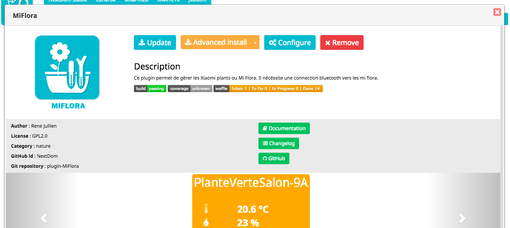

Présentation
============

Ce plugin permet de d'installer les plugins de la communauté NextDom.

Comment installer ce plugin
===========================

Il faut d'abord aller dans Jeedom => "Configuration". Dans l'onglet "Mises à jour", choisir l'onglet "Github" et cocher la case "Activer Github". Enfin sauvegarder.
Retourner sur la page de gestion des plugins.
Faire apparaitre le menu gauche puis clicker sur "Ajouter depuis une autre source".
Enfin choisir la source "GitHub".
Remplir comme suit et valider :
 - ID logique du plugin : AlternativeMarketForJeedom
 - Utilisateur ou organisation du dépot : NextDom
 - Nom du dépôt : plugin-AlternativeMarketForJeedom
 - Branche : master

Installation/Paramétrage
========================

L'installation sera automatique. Aucun paramétrage n'est nécessaire.

FAQ
===

Question n°1 ?
-------------------------------------------------------

Réponse n°1

Question n°2 ?
--------------------------------------------------
Réponse n°2

Ou trouver le changelog
-----------------------
[Ici](https://jeedom.github.io/plugin-template/fr_FR/changelog.html)

