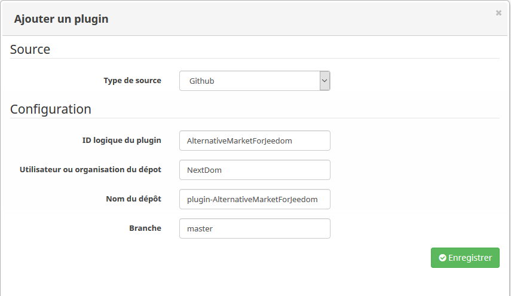

Comment installer ce plugin ?
=============================

1. Activer l'option de Jeedom permettant d'installer directement depuis GitHub. Pour cela, cocher la case ci-dessous se trouvant dans l'onglet __Mise à jour__ de la configuration : 

2. Dans la __Gestion des plugins__, faire apparaitre le menu de gauche et cliquer sur __Ajouter depuis une autre source__

3. Remplir les informations suivantes : 
* Type de source : __GitHub__,
* ID logique du plugin : __AlternativeMarketForJeedom__,
* Utiliser ou organisation du dépôt : __NextDom__,
* Nom du dépôt : __plugin-AlternativeMarketForJeedom__,
* Branche : __master__ (par défaut).

